# Introduction #

This branch documents the experimental work associated with the research presented in the paper "Network-Level Bit-Flipping Attacks on Cooperative Adaptive Cruise Control in 5G Environment", which has been accepted by [IEEE VTC Spring 2026](https://events.vtsociety.org/vtc2026-spring/) and will be published.

# Background #

This research was conducted on the 5G platform provided by [OpenAirInterface](https://openairinterface.org/) ([RAN Repository](https://gitlab.eurecom.fr/oai/openairinterface5g)), using RAN version 2024.w43. 

All experiments in this branch were carried out on a single machine using RFSIM.

Reference Tutorials:
 *  [NR_SA_Tutorial_OAI_CN5G](https://gitlab.eurecom.fr/oai/openairinterface5g/-/blob/develop/doc/NR_SA_Tutorial_OAI_CN5G.md)
 *  [NR_SA_Tutorial_OAI_nrUE](https://gitlab.eurecom.fr/oai/openairinterface5g/-/blob/develop/doc/NR_SA_Tutorial_OAI_nrUE.md)

# Prerequisites #

 *  Ensure your machine meets the minimum hardware requirements outlined in the tutorial "[NR_SA_Tutorial_OAI_nrUE](https://gitlab.eurecom.fr/oai/openairinterface5g/-/blob/develop/doc/NR_SA_Tutorial_OAI_nrUE.md)".
 *  Install CN5G in your **user’s home directory** by following the "[NR_SA_Tutorial_OAI_CN5G](https://gitlab.eurecom.fr/oai/openairinterface5g/-/blob/develop/doc/NR_SA_Tutorial_OAI_CN5G.md)" guide.
 * Clone this branch into your **user's home directory**.

# Main Modifications #

1. The bit-flipping attack is implemented in the `deliver_pdu_drb_ue()` function located in `openair2/LAYER2/nr_pdcp/nr_pdcp_oai_api.c`. To enable or disable the attack, set the `attack_enable` variable in `openair2/LAYER2/nr_pdcp/nr_pdcp_oai_api.c` to 1 or 0 respectively. If the attack is enabled, we should specify exactly which bits in which bytes we would flip. After making these changes, rebuild the OAI gNB and nrUE as described in the final command of step 3.2 in the [NR_SA_Tutorial_OAI_nrUE](https://gitlab.eurecom.fr/oai/openairinterface5g/-/blob/develop/doc/NR_SA_Tutorial_OAI_nrUE.md).

2. The keystream-based shuffling is implemented in the `nr_pdcp_entity_process_sdu()` and `nr_pdcp_entity_recv_pdu()` functions within `openair2/LAYER2/nr_pdcp/nr_pdcp_entity.c`, along with all related helper functions (`prng_seed()`, `prng_next()`, `prp_permute_bits()`, `prp_invert_permute_bits()`) added at the beginning of the same module. To enable or disable the shuffling, set the `shuffle_enable` variable in `openair2/LAYER2/nr_pdcp/nr_pdcp_entity.c` to 1 or 0 respectively, then rebuild the OAI gNB and nrUE. 

3. The flipped bit identification is implemented in the `nr_pdcp_entity_recv_pdu()` function within `openair2/LAYER2/nr_pdcp/nr_pdcp_entity.c`, along with all related helper functions added at the beginning of the same module, which are:
   * `both_checksum_recovery()` corresponds to Scenario 0 in the paper.
   * `two_block_single_zero_recovery()` corresponds to Scenario 4 and 11 in the paper.
   * `two_block_single_one_checksum_recovery()` corresponds to Scenario 1 in the paper.
   * `two_block_general_recovery()` corresponds to Scenario 8 in the paper.
   * `one_block_checksum_recovery()` corresponds to Scenario 2,3,6,7 in the paper.
   * `one_block_payload_recovery()` corresponds to Scenario 9,10,13,14 in the paper.

4. Within `~/openairinterface5gTwoBitRecover/openair2/LAYER2/nr_pdcp/nr_pdcp_entity.c`, locate the code line `FILE *fp = fopen("/home/derek/openairinterface5gTwoBitRecover/openair2/LAYER2/nr_pdcp/checksums.csv", "a");`. Make sure to update the path in this line to match the directory where you have downloaded this branch. Additionally, it is recommended to delete any existing `checksums.csv` file before each experiment.

5. To enable or disable the flipped bit identification, set the `bitflipIden_enable` variable in `openair2/LAYER2/nr_pdcp/nr_pdcp_entity.c` to 1 or 0 respectively, then rebuild the OAI gNB and nrUE as described in the final command of step 3.2 in the [NR_SA_Tutorial_OAI_nrUE](https://gitlab.eurecom.fr/oai/openairinterface5g/-/blob/develop/doc/NR_SA_Tutorial_OAI_nrUE.md).

 

6. Other new-added directories:
  * The `cacc_venv` directory contains the virtual environment for running the CACC application. 
  * The `application` directory includes the application modules for both the preceding and following CAVs, the preceding CAV's trajectory data from the RDS 1000, experimental results shown in this README file, and additional Python modules for experiment support such as better plot generation for paper submission.
  * The `graphs` directory holds figures for publication, generated by `plotredraw.py` in the `application` directory.
  * The `images` directory contains screenshots used in this README.
  * The `results` directory stores all experimental data collected during the research process, including unsuccessful attempts.

# Experiment 1: Run Benign Case and Implement Bit-flipping Attacks on an CACC Application #

## Benign ##

To simulate the benign CACC application with no attack, set `attack_enable`, `shuffle_enable`, and `bitflipIden_enable` all to 0, then rebuild the OAI gNB and nrUE. 

In the `~/openairinterface5gTwoBitRecover/application/ego_CAM.py`, set the `counter` variable to -1.

If `shuffle_enable` and/or `bitflipIden_enable` is enabled (set to 1), that's also acceptable. Just make sure to use `ego_CAM_ext.py` instead of `ego_CAM.py` in step 5 below when `bitflipIden_enable` is enabled.

Now, we can follow the steps below to run the simulation experiment:

1. Start the CN
<pre>
# open a new terminal (terminal 1)
cd ~/oai-cn5g
docker compose up -d

# check whether all components in CN are healthy
docker ps 
</pre>

2. Start the gNB
<pre>
# open a new terminal (terminal 2)
cd ~/openairinterface5gTwoBitRecover/cmake_targets/ran_build/build
sudo ./nr-softmodem -O ../../../targets/PROJECTS/GENERIC-NR-5GC/CONF/gnb.sa.band78.fr1.106PRB.usrpb210.conf --gNBs.[0].min_rxtxtime 6 --rfsim --sa | tee ~/openairinterface5gTwoBitRecover/logs/gNB.log
</pre>

3. Start the UE
<pre>
# open a new terminal (terminal 3)
cd ~/openairinterface5gTwoBitRecover/cmake_targets/ran_build/build
sudo ./nr-uesoftmodem -r 106 --numerology 1 --band 78 -C 3619200000 --sa --uicc0.imsi 001010000000001 --rfsim | tee ~/openairinterface5gTwoBitRecover/logs/UE.log
</pre>

4. Check whether CN assigns IP to UE
<pre>
# open a new terminal (terminal 4)
ifconfig

# you can close terminal 4 after the check
</pre>

If there is no inteface named `oaitun_ue1`, stop the terminal 2 and 3 by keyboard interrupt (Ctrl+C), and stop the CN. Wait for a few seconds and restart from step 1.

<pre>
# terminal 1
docker compose down
</pre>

5. Copy files inside the container, and run following CAV simulation inside the container
<pre>
# Open a new terminal (terminal 5)

docker cp ~/openairinterface5gTwoBitRecover/application/ego_CAM.py oai-ext-dn:/tmp
docker cp ~/openairinterface5gTwoBitRecover/application/data oai-ext-dn:/tmp

# After the files are copied into the container:

docker exec -it oai-ext-dn bash

apt-get update
apt-get install -y python3 python3-pip python3.10-venv
mkdir -p /tmp/graphs
cd /tmp 
python3 -m venv cacc-venv 
source cacc-venv/bin/activate

pip install numpy matplotlib pandas

python3 ego_CAM.py

# When the experiment is done, deactivate the virtual environment:
deactivate
</pre>

6. Run the simulation of preceding CAV locally in venv

<pre>
# Open a new terminal (terminal 6)
cd ~/openairinterface5gTwoBitRecover/application/
source ../cacc-venv/bin/activate
python3 preceding_CAM.py

# When the experiment is done, deactivate the virtual environment:
deactivate
</pre>

7. Copy the plots inside the container to the local machine:

<pre>
# Open a new terminal (terminal 7)
docker cp oai-ext-dn:/tmp/graphs/CACC_Time_Headway.png     ~/openairinterface5gTwoBitRecover/application/figures/
docker cp oai-ext-dn:/tmp/graphs/CACC_Space_Headway.png    ~/openairinterface5gTwoBitRecover/application/figures/
docker cp oai-ext-dn:/tmp/graphs/CACC_Acceleration.png     ~/openairinterface5gTwoBitRecover/application/figures/
docker cp oai-ext-dn:/tmp/graphs/CACC_Position.png      ~/openairinterface5gTwoBitRecover/application/figures/
docker cp oai-ext-dn:/tmp/graphs/CACC_Velocity.png      ~/openairinterface5gTwoBitRecover/application/figures/
docker cp oai-ext-dn:/tmp/ego_traj.csv    ~/openairinterface5gTwoBitRecover/application/
</pre>

8. Open the ego_traj.csv file
<pre>
# Open a new terminal:
libreoffice --calc ~/openairinterface5gTwoBitRecover/application/ego_traj.csv 
</pre>

The plots and the trajectory CSV file is stored in `~/openairinterface5gTwoBitRecover/application/figures/benign`. Example plot is shown below. We can see that the real trajectory overlap with the benign trajectory since there is no attack.

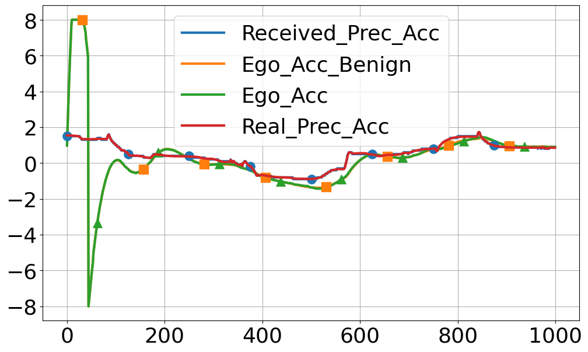
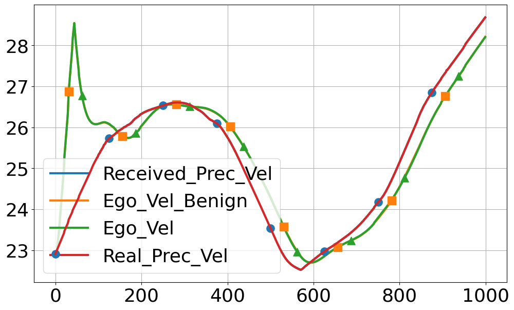
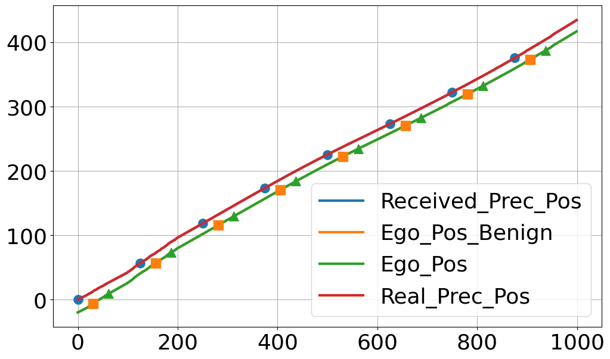
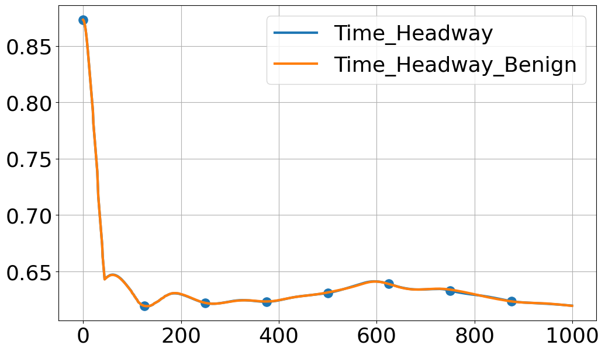

## Attack ##

To perform a bit-flipping attack, first configure the specific target bits and data bytes we want to flip in `openair2/LAYER2/nr_pdcp/nr_pdcp_oai_api.c`. Set the `attack_enable` to 1, then rebuild both the OAI gNB and nrUE to apply the changes. Next, in `~/openairinterface5gTwoBitRecover/application/ego_CAM.py`, initialize the `counter` variable to 0. Once these steps are complete, run the simulation from step 1 to 8 as described for the benign case.

*Note: If you have just simulated the benign case and don't want to start over, you can simply run "docker cp ~/openairinterface5gTwoBitRecover/application/ego_CAM.py oai-ext-dn:/tmp" to upload the updated ego_CAM.py, and then do the attack simulation.*

To ensure synchronized communication during the experiment, start `python3 ego_CAM.py` in terminal 5 and then immediately run `python3 preceding_CAM.py` in terminal 6, preferably within the following CAV's timeout window, which is 0.3 second for now. This is important because the bit-flipping attack affects the very first message from the preceding CAV, which may cause the following CAV to miss it. Prompt execution helps the receiver correctly identify the initial packet and prevents synchronization issues.

Here is an example of checksum bit-flipping attack with two bit flips. We can see that the attack has about 50% success rate. 
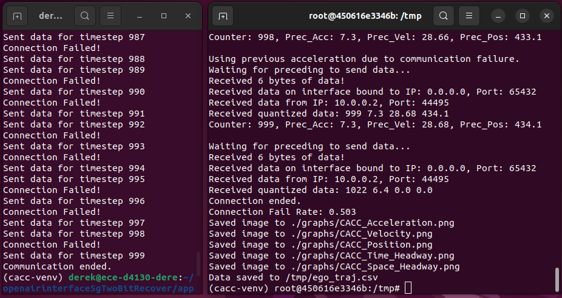

The benign trajectory and the trajectory under attack is shown below. We can see that the attack is impactful in terms of the stability of CACC.
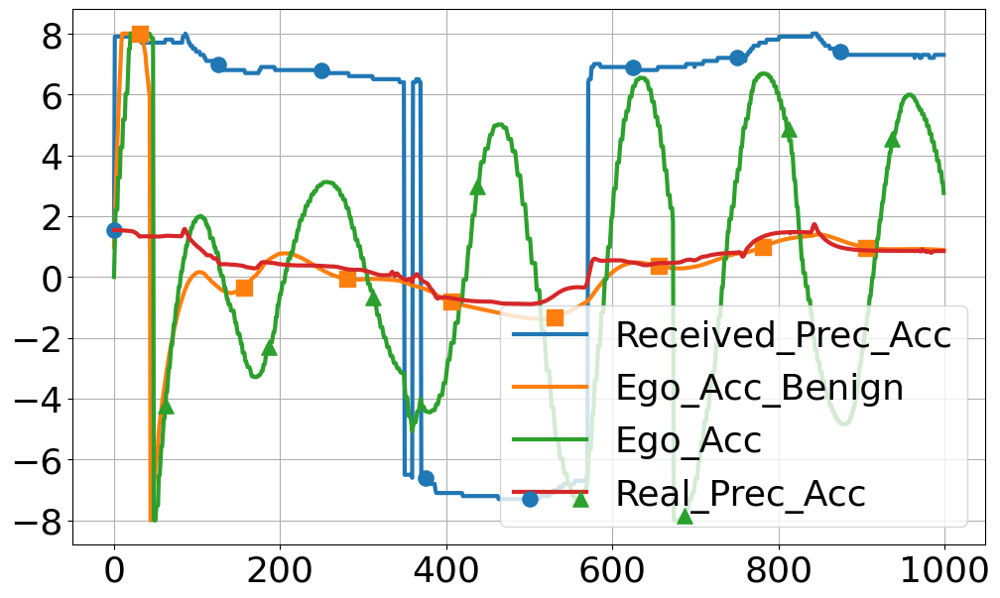
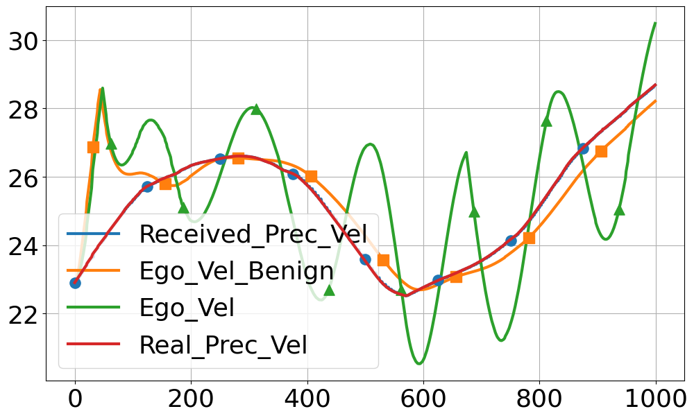
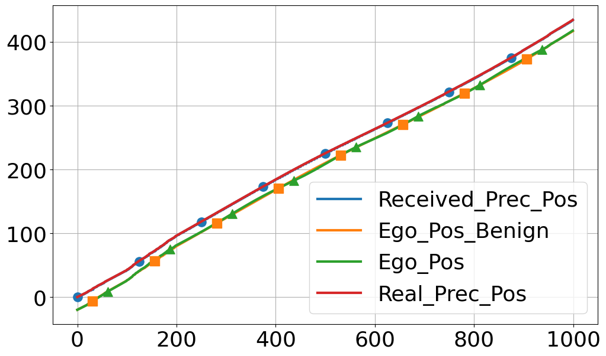
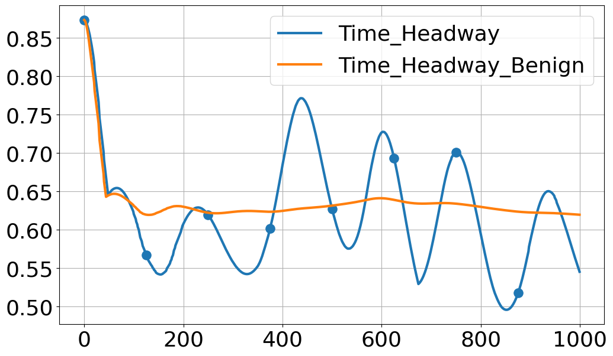

We can change the bits we flipped and do the simulation to find other impactful attacks.

# Experiment 2 Defense Simulation under Two Bit Flipping Attacks #

To test our defense mechanism, we should set `attack_enable`, `shuffle_enable`, and `bitflipIden_enable` all to 1. Because of the randomness of keystream-based shuffle, there is little difference for which two bits the attacker flip since their indices will be randomized at the receiver after shuffling is reversed. However, for the experiment, it is still recommended to attack the same bit index in different words to align with the attacker model. Finally, rebuild the OAI gNB and nrUE as described in the final command of step 3.2 in the [NR_SA_Tutorial_OAI_nrUE](https://gitlab.eurecom.fr/oai/openairinterface5g/-/blob/develop/doc/NR_SA_Tutorial_OAI_nrUE.md).

The simulation process is shown below:

1. Start the CN
<pre>
# open a new terminal (terminal 1)
cd ~/oai-cn5g
docker compose up -d

# check whether all components in CN are healthy
docker ps 
</pre>

2. Start the gNB
<pre>
# open a new terminal (terminal 2)
cd ~/openairinterface5gTwoBitRecover/cmake_targets/ran_build/build
sudo ./nr-softmodem -O ../../../targets/PROJECTS/GENERIC-NR-5GC/CONF/gnb.sa.band78.fr1.106PRB.usrpb210.conf --gNBs.[0].min_rxtxtime 6 --rfsim --sa | tee ~/openairinterface5gTwoBitRecover/logs/gNB.log
</pre>

3. Start the UE
<pre>
# open a new terminal (terminal 3)
cd ~/openairinterface5gTwoBitRecover/cmake_targets/ran_build/build
sudo ./nr-uesoftmodem -r 106 --numerology 1 --band 78 -C 3619200000 --sa --uicc0.imsi 001010000000001 --rfsim | tee ~/openairinterface5gTwoBitRecover/logs/UE.log
</pre>

4. Check whether CN assigns IP to UE
<pre>
# open a new terminal (terminal 4)
ifconfig

# you can close terminal 4 after the check
</pre>

If there is no inteface named `oaitun_ue1`, stop the terminal 2 and 3 by keyboard interrupt (Ctrl+C), and stop the CN. Wait for a few seconds and start from step 1.

<pre>
# terminal 1
docker compose down
</pre>

5. Copy files inside the container, and run following CAV simulation inside the container
<pre>
# Open a new terminal (terminal 5)

docker cp ~/openairinterface5gTwoBitRecover/application/ego_CAM_ext.py oai-ext-dn:/tmp
docker cp ~/openairinterface5gTwoBitRecover/application/data oai-ext-dn:/tmp

# After the files are copied into the container:

docker exec -it oai-ext-dn bash

apt-get update
apt-get install -y python3 python3-pip python3.10-venv
mkdir -p /tmp/graphs
cd /tmp 
python3 -m venv cacc-venv 
source cacc-venv/bin/activate

pip install numpy matplotlib pandas

python3 ego_CAM_ext.py

# When the experiment is done, deactivate the virtual environment:
deactivate
</pre>

6. Run the simulation of preceding CAV locally in venv

<pre>
# Open a new terminal (terminal 6)
cd ~/openairinterface5gTwoBitRecover/application/
source ../cacc-venv/bin/activate
python3 preceding_CAM.py

# When the experiment is done, deactivate the virtual environment:
deactivate
</pre>

7. Copy the plots inside the container to the local machine:

<pre>
# Open a new terminal (terminal 7)
docker cp oai-ext-dn:/tmp/graphs/CACC_Time_Headway.png     ~/openairinterface5gTwoBitRecover/application/figures/
docker cp oai-ext-dn:/tmp/graphs/CACC_Space_Headway.png    ~/openairinterface5gTwoBitRecover/application/figures/
docker cp oai-ext-dn:/tmp/graphs/CACC_Acceleration.png     ~/openairinterface5gTwoBitRecover/application/figures/
docker cp oai-ext-dn:/tmp/graphs/CACC_Position.png      ~/openairinterface5gTwoBitRecover/application/figures/
docker cp oai-ext-dn:/tmp/graphs/CACC_Velocity.png      ~/openairinterface5gTwoBitRecover/application/figures/
docker cp oai-ext-dn:/tmp/ego_traj.csv    ~/openairinterface5gTwoBitRecover/application/
</pre>

8. Open the ego_traj.csv file
<pre>
# Open a new terminal:
libreoffice --calc ~/openairinterface5g2024w43/application/ego_traj.csv 
</pre>

The result of one of our experiments with our defense is saved in `~/openairinterface5gTwoBitRecover/application/figures/mitigation`, and the corresponding plots are shown below. The CACC trajectory after mitigation mostly overlaps with the benign scenario. Although acceleration occasionally differs, it does not affect the safety, efficiency, and stability of CACC.

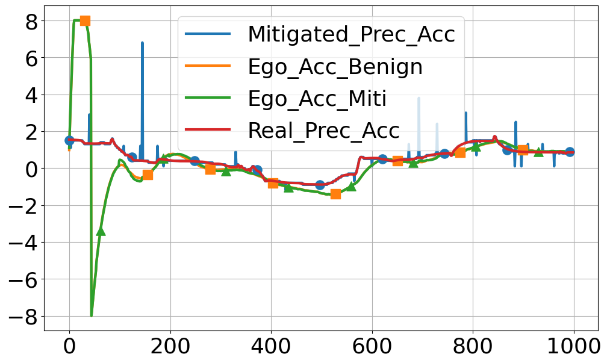
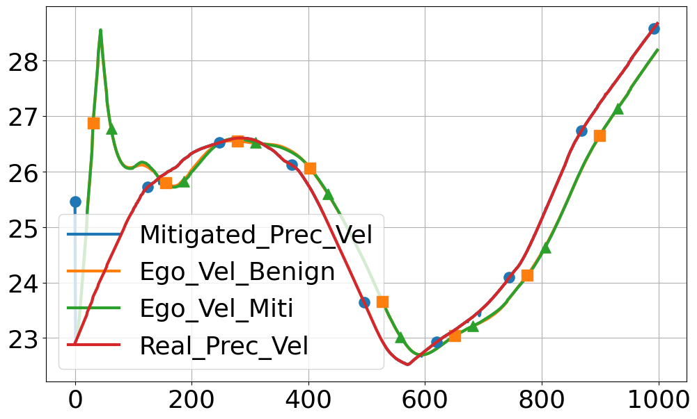
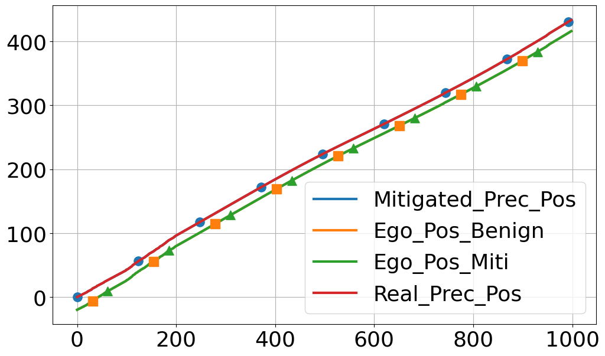
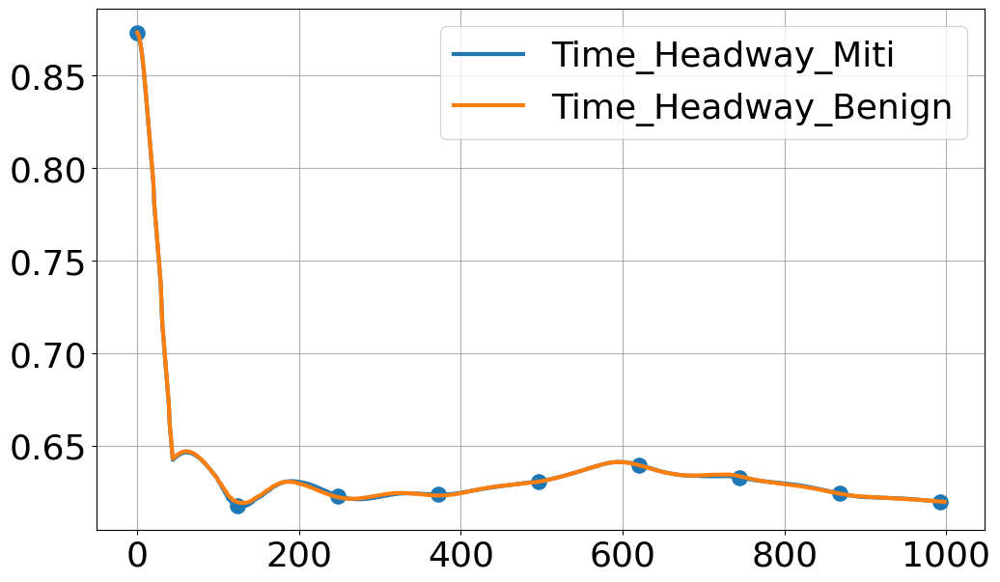

## Existed Bug ##

When running the experiment with our defense, we sometimes encounter errors in terminal 2 (gNB terminal) such as `free(): invalid next size (fast)`, `free(): double free detected in tcache 2`, and `corrupted size vs. prev_size`. According to the gNB log, `corrupted size vs. prev_size` often occurs after the ciphering operation, and `free(): invalid next size (fast)` usually occurs during or after the IP header checksum calculation. This suggests a likely heap corruption related to memory allocation in our implementation. Currently, we have not resolved this low-level memory allocation bug, but it does not appear to be caused by the defense logic itself since some experiments complete successfully. When the error occurs, we typically restart the experiment from the beginning, then it is very likely that the experiment would succeed for the first few tries. We are actively working to fix this issue and would appreciate any suggestions!

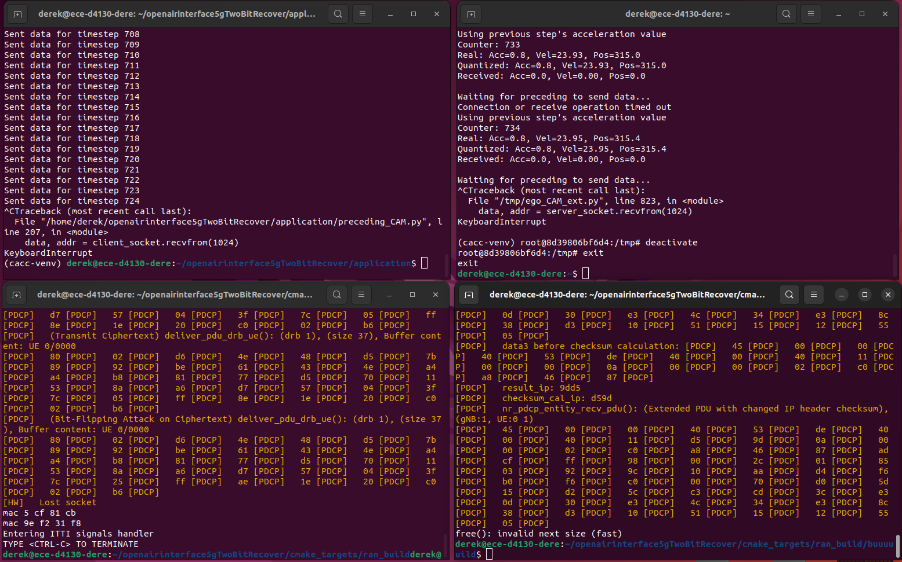

# Notes #

1. The figure below illustrates the structure of the PDU at the PDCP layer. The `nr_pdcp_entity_process_sdu()` function handles PDCP SDUs. Since attacks are only considered on the checksum and data payload, we shuffle the bitstream beginning after the 26th byte. The functions `nr_pdcp_entity_recv_pdu()` and `deliver_pdu_drb_ue()` process PDCP PDUs; in these, attack and deshuffling operations start from the 29th byte.
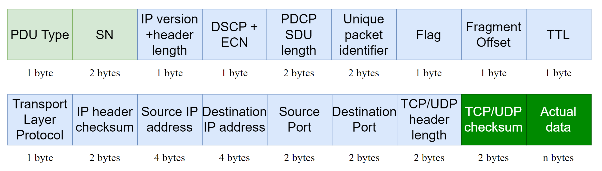

2. The UDP checksum contains the fields in the figure below (source: [UDPWiki](https://en.wikipedia.org/wiki/User_Datagram_Protocol)). The `Length` and `UDP length` in the figure means the length of `UDP header and the data`. 

   For example, for this UDP pseudo-header for checksum computation:

  <pre>
    unsigned char data[] = {
        0x0a, 0x00, 0x00, 0x02, 0xc0, 0xa8, 0x46, 0x87,
        0x00, 0x11, 0x00, 0x13, 0xad, 0xcf, 0x04, 0xd2,
        0x00, 0x13, 0x00, 0x00, 0x22, 0x70, 0x33, 0x30,
        0x30, 0x76, 0x32, 0x35, 0x61, 0x32, 0x22, 0x00};
  </pre>

   `0x0a, 0x00, 0x00, 0x02` is the source IP address, `0xc0, 0xa8, 0x46, 0x87` is the destination IP address, `0x00, 0x11` means UDP protocol. `0xad, 0xcf` is the source port, `0x04, 0xd2` is the destination port, `0x00, 0x00` is the reserved checksum field, and `0x22, 0x70, 0x33, 0x30, 0x30, 0x76, 0x32, 0x35, 0x61, 0x32, 0x22` is the data payload, `0x00` is the padding zero. The UDP header contains source port field, destination port field, UDP length field, and UDP checksum field, which is `8 bytes` for total. Since the data payload is `11 bytes`, the `UDP length` for total is `19 bytes`, which is `0x00, 0x13` in octet (16+2+1). We need to rebuild this data through the received PDCP PDU. 

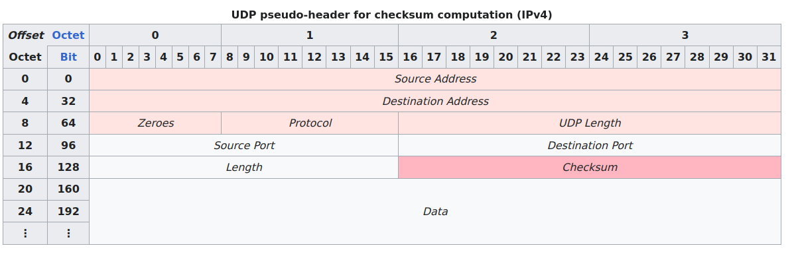

# Citation #

The citation of the paper will be added after it is published.