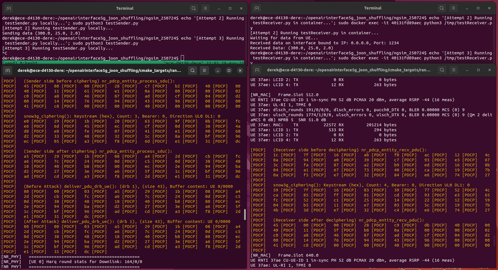
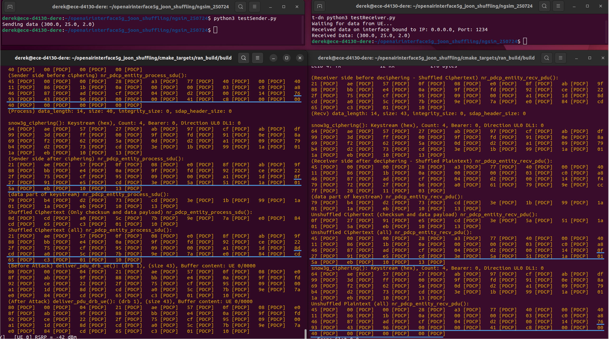
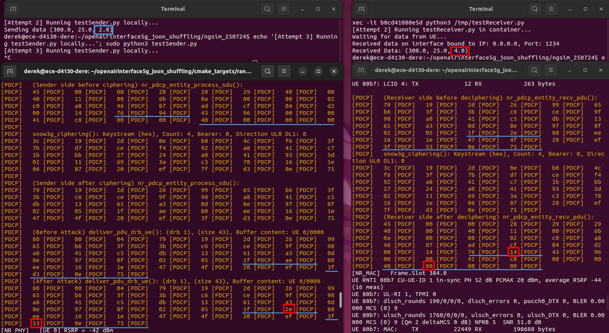
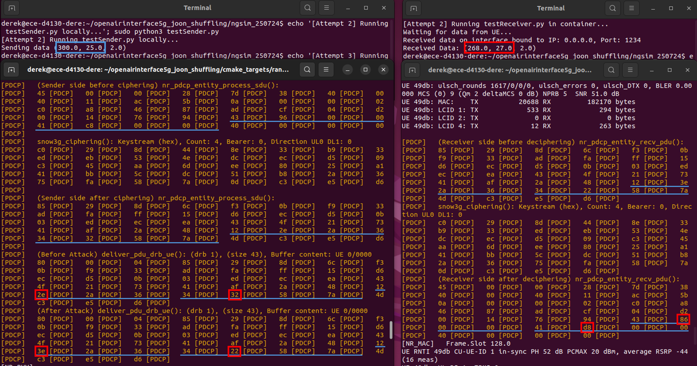
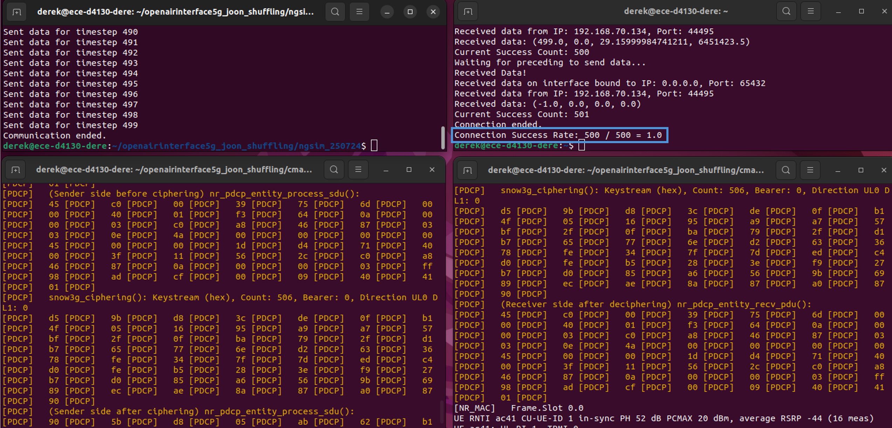
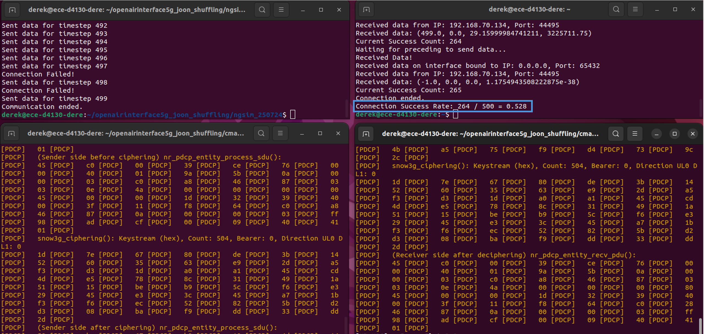
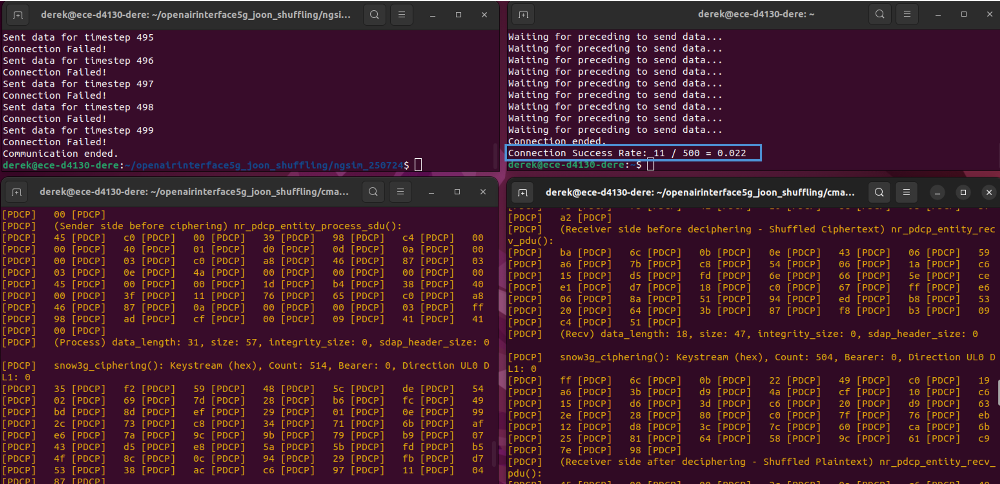

# Introduction #

This branch documents the experimental work associated with the research presented in the paper "Bit-Flipping Attack Exploration and Countermeasure in 5G Networks", which is accepted for publication at the REUNS Workshop, IEEE MASS 2025 

# Background #

This research was conducted on the 5G platform provided by [OpenAirInterface](https://openairinterface.org/) ([RAN Repository](https://gitlab.eurecom.fr/oai/openairinterface5g)), using RAN version 2024.w43. 

All experiments in this branch were carried out on a single machine using RFSIM.

Refernce Tutorials:
 *  [NR_SA_Tutorial_OAI_CN5G](https://gitlab.eurecom.fr/oai/openairinterface5g/-/blob/develop/doc/NR_SA_Tutorial_OAI_CN5G.md)
 *  [NR_SA_Tutorial_OAI_nrUE](https://gitlab.eurecom.fr/oai/openairinterface5g/-/blob/develop/doc/NR_SA_Tutorial_OAI_nrUE.md)

# Prerequisites #

 *  Ensure your machine meets the minimum hardware requirements outlined in the tutorial "[NR_SA_Tutorial_OAI_nrUE](https://gitlab.eurecom.fr/oai/openairinterface5g/-/blob/develop/doc/NR_SA_Tutorial_OAI_nrUE.md)".
 *  Install CN5G in your **user’s home directory** by following the "[NR_SA_Tutorial_OAI_CN5G](https://gitlab.eurecom.fr/oai/openairinterface5g/-/blob/develop/doc/NR_SA_Tutorial_OAI_CN5G.md)" guide.
 * Clone this branch into your **user's home directory**.

# Main Modifications #
 *  The bit-flipping attack is implemented in the `deliver_pdu_drb_ue()` function within `openair2/LAYER2/nr_pdcp/nr_pdcp_oai_api.c`.
 *  The keystream-based shuffling defense is implemented in the `nr_pdcp_entity_process_sdu()` and `nr_pdcp_entity_recv_pdu()` functions within `openair2/LAYER2/nr_pdcp/nr_pdcp_entity.c`, along with all related functions (`prng_seed()`, `prng_next()`, `prp_permute_bits()`, `prp_invert_permute_bits()`) added to the same module.
 *  The "data" directory contains data retrieved from the [NGSIM](https://data.transportation.gov/stories/s/Next-Generation-Simulation-NGSIM-Open-Data/i5zb-xe34/#trajectory-data) dataset.
 *  The "cacc-venv" directory stores the virtual environment created for the experiments.
 *  The "ngsim_250724" directory includes the Python modules that represent the applications running on 5G.
 *  To ensure smooth simulation, you can add the following lines to your user’s sudoers file by running `sudo visudo`:
    * `<yourusername> ALL=(ALL) NOPASSWD: </full/path/to/nr-softmodem>`
    * `<yourusername> ALL=(ALL) NOPASSWD: </full/path/to/nr-uesoftmodem>`
    * `<yourusername> ALL=(ALL) NOPASSWD: </usr/bin/docker cp *, /usr/bin/docker exec *, /usr/bin/docker ps, /usr/bin/python3>` *(If `docker` or `python3` are installed in a different directory than `/usr/bin` in your machine, please update the paths accordingly.)*

# Experiment 1: Vehicle A sends a single message to Vehicle B #

In this experiment, Vehicle A transmits its current state (position: 300.0, velocity: 25.0, acceleration: 2.0) to Vehicle B via 5G communication. Both a benign transmission and a transmission subjected to bit-flipping attacks are simulated. 

Check the variable `attack_enable` in `nr_pdcp_oai_api.c` and `shuffle_enable` in `nr_pdcp_entity.c` before each experiment:
  * Experiment 1.1: set both `attack_enable` and `shuffle_enable` to zero.
  * Experiment 1.2: set `attack_enable` to zero, and `shuffle_enable` to one.
  * Experiment 1.3: set `attack_enable` to one, and `shuffle_enable` to zero. Uncomment the code for the checksum bit-flipping attack under "Test for Experiment 1.3" in `nr_pdcp_oai_api.c`.
  * Experiment 1.4: set `attack_enable` to one, and `shuffle_enable` to zero. Uncomment the code for the payload bit-flipping attack under  "Test for Experiment 1.4" in `nr_pdcp_oai_api.c`.

Then, recompile the RAN network through the following commands:
<pre>
cd ~/&lt;path to the directory of the branch&gt;/cmake_targets
./build_oai -w USRP --ninja --nrUE --gNB --build-lib "nrscope" -C
</pre>

Then, run the experiment:
<pre>
cd ~/&lt;path to the directory of the branch&gt;
bash oai_SingleMessage.sh
</pre>

## 1.1 Benign Case ##

This figure illustrates the experimental result without attack and shuffling. The sender transmits the three values (300.0, 25.0, 2.0) to the receiver, which successfully receives them over the 5G network.

*This figure is divided into four panels: the upper left displays the application layer of sender Vehicle A; the lower left shows the 5G protocol layers of Vehicle A; the upper right presents the application layer of receiver Vehicle B; and the lower right shows the 5G protocol layers of Vehicle B. All figures in subsequent subsections use this same format.*

## 1.2 Benign Case with Shuffling ##

This figure shows the experimental result for benign communication with shuffling applied. In this setup, only the checksum and data payload fields are shuffled, indicated by the blue lines in the figure. The sender replaces these fields with shuffled bitstream, and the receiver successfully restores them to retrieve the original message. This demonstrates that, in the absence of an attack, shuffling does not interfere with normal communication.

## 1.3 Checksum Bit-Flipping Attack ##

This figure presents the experimental result under a checksum bit-flipping attack, where one bit is flipped in the checksum field and another in the data payload. The blue lines indicate the checksum and affected data payload fields, while the bytes altered by the bit-flipping appear in red boxes. As shown, the attack successfully changes the acceleration value of Vehicle A from 2.0 to 4.0.

## 1.4 Payload Bit-Flipping Attack ##

This figure displays the result of a payload bit-flipping attack, in which bit-flipping occurs solely within the data payload field. As in the previous experiment, the blue line highlights the affected field, and the red boxes indicate the bytes altered by the attack. As a result, the transmitted position and velocity values of Vehicle A are successfully mutated.

# Experiment 2. Vehicle A shares its states to Vehicle B for a period of time #

In this experiment, Vehicle A shares its trajectory with Vehicle B while traveling on the road. The simulation uses trajectory data from the [NGSIM](https://data.transportation.gov/stories/s/Next-Generation-Simulation-NGSIM-Open-Data/i5zb-xe34/#trajectory-data) dataset.

Check the variable `attack_enable` in `nr_pdcp_oai_api.c` and `shuffle_enable` in `nr_pdcp_entity.c` before each experiment:
  * Experiment 2.1: set both `attack_enable` and `shuffle_enable` to zero.
  * Experiment 2.2: set `attack_enable` to one, and `shuffle_enable` to zero. Uncomment the code under "Test for Experiment 2.2 and 2.3" in `nr_pdcp_oai_api.c`. 
  * Experiment 2.3: set both `attack_enable` and `shuffle_enable` to one. Uncomment the code under "Test for Experiment 2.2 and 2.3" in `nr_pdcp_oai_api.c`. 

Then, recompile the RAN network through the following commands:
<pre>
cd ~/&lt;path to the directory of the branch&gt;/cmake_targets
./build_oai -w USRP --ninja --nrUE --gNB --build-lib "nrscope" -C
</pre>

Then, run the experiment:
<pre>
cd ~/&lt;path to the directory of the branch&gt;
bash oai_NGSIMtraj.sh
</pre>

Then, verify that the IP address of `oaitun_ue1` matches the value of the `specific_address` variable in `preceding.py`. If it does not, update `specific_address` accordingly.

To simulate the application layer of Vehicle B, open a new terminal and run:
<pre>
sudo docker exec -it oai-ext-dn python3 /tmp/ego.py
</pre>

To simulate the application layer of Vehicle A, open another terminal and run:
<pre>
cd ~/openairinterface5g_joon_shuffling/ngsim_250724;
../cacc-venv/bin/python3 preceding.py;
</pre>

## 2.1 Benign Case ##

This figure shows the simulation results without any attack. All messages from Vehicle A are transmitted successfully to Vehicle B.

## 2.2 Bit-Flipping Attack ##

This figure presents the results under bit-flipping attack (two bits flipped). The simulation outcomes vary slightly across experiments due to changes in the keystream and trajectory data, but the successful transmission rate remains around 50%, primarily because checksum error detection at the transport layer blocks corrupted messages.

## 2.3 Bit-Flipping Attack with Shuffling Defense ##

This figure displays the results of the same bit-flipping attack as in Experiment 2.2, but with keystream-based shuffling applied. As shown, the successful transmission rate consistently falls well below 50%. While the exact value may vary across experiments due to different random seeds used for shuffling, it remains significantly lower than 50%.

# Notes #

1. The figure below illustrates the structure of the PDU at the PDCP layer. The `nr_pdcp_entity_process_sdu()` function handles PDCP SDUs. Since attacks are only considered on the checksum and data payload, we shuffle the bitstream beginning after the 26th byte. The functions `nr_pdcp_entity_recv_pdu()` and `deliver_pdu_drb_ue()` process PDCP PDUs; in these, attack and deshuffling operations start from the 29th byte.

2. Fig. 6 and 7 in our paper are adapted from Experiment 1.3 and 1.4. 
3. The results presented in Tables I and III are derived from Experiment 2.2, using various vehicle trajectories and different flipped bits.  
4. Table II reports results from Experiment 2.3, also varying vehicle trajectories and the flipped bits.

# Citation #

The citation of the paper will be added after it is published.